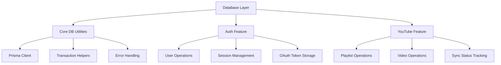
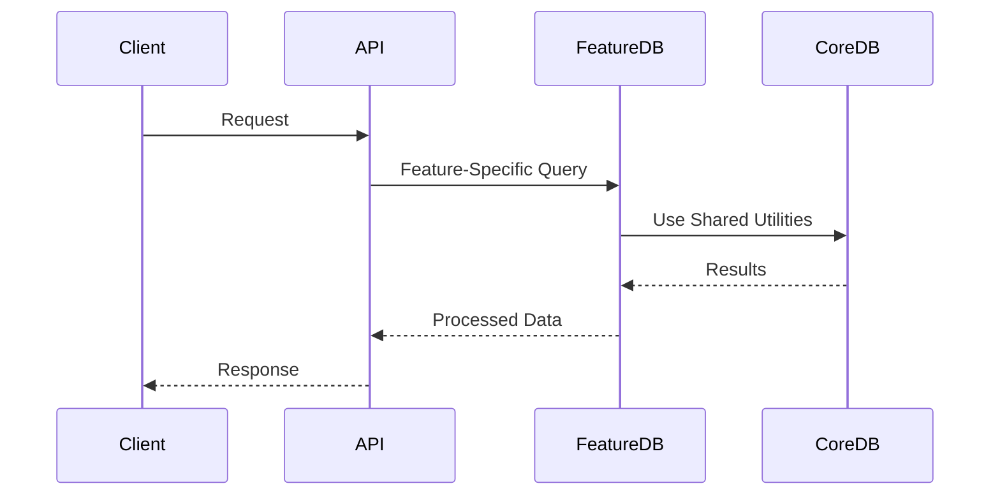

# Playlist Manager Documentation

## Database Architecture

### Feature-Based DB Operations Structure



### Core DB Utilities (`db/`)
- `index.ts`: Exports prisma client and utilities
- `utils.ts`: Shared DB utilities and helpers
  - Transaction management
  - Error handling wrappers
  - Common query patterns

### Auth Feature DB Operations (`auth/db.ts`)
```typescript
// User Management
createUser()
updateUser()
getUserByEmail()

// Session Management
createSession()
getSessionByToken()
deleteSession()

// OAuth Token Management
storeOAuthToken()
getOAuthToken()
```

### YouTube Feature DB Operations (`youtube/data/`)
```typescript
// Playlist Operations
createPlaylist()
updatePlaylist()
getUserPlaylists()
deletePlaylist()

// Video Operations
addVideoToPlaylist()
updateVideoPosition()
removeVideoFromPlaylist()

// Sync Operations
updateSyncStatus()
getPendingSyncs()
```

## Key Benefits

1. **Feature Cohesion**:
   - All related DB operations stay with their feature
   - Clear boundaries between features
   - Easier to understand complete feature flow

2. **Maintainability**:
   - Changes isolated to specific features
   - Reduced risk of cross-feature impact
   - Clearer responsibility boundaries

3. **Scalability**:
   - New features can be added independently
   - Easier to split into microservices if needed
   - Clear migration paths for feature evolution

## Data Access Patterns



This structure provides:
- Clear separation of concerns
- Better feature isolation
- Shared utilities without tight coupling
- Easier testing and maintenance
- Clearer evolution paths for features
