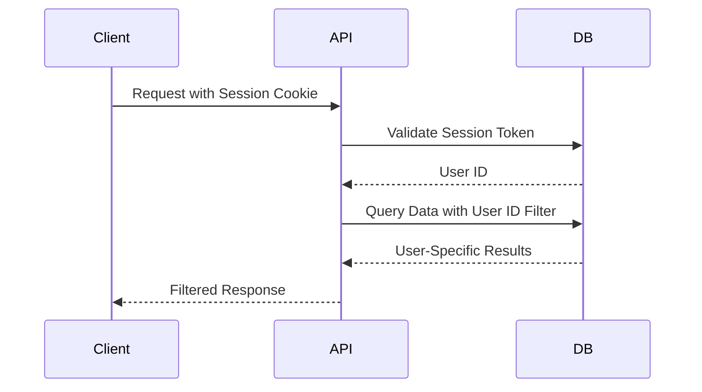

# Playlist Manager Documentation

## Database Schema Design

### Core Tables

```prisma
model User {
  id             String         @id @default(uuid())
  email          String         @unique
  passwordHash   String
  sessions       Session[]
  playlists      Playlist[]
  oauthTokens    OAuthToken[]
  createdAt      DateTime       @default(now())
  updatedAt      DateTime       @updatedAt
}

model Session {
  id        String   @id @default(uuid())
  userId    String
  user      User     @relation(fields: [userId], references: [id])
  token     String   @unique
  expiresAt DateTime
  createdAt DateTime @default(now())
}

model Playlist {
  id          String          @id @default(uuid())
  userId      String
  user        User            @relation(fields: [userId], references: [id])
  youtubeId   String          @unique
  title       String
  description String?
  items       PlaylistItem[]
  createdAt   DateTime        @default(now())
  updatedAt   DateTime        @updatedAt
}

model PlaylistItem {
  id          String   @id @default(uuid())
  playlistId  String
  playlist    Playlist @relation(fields: [playlistId], references: [id])
  youtubeId   String
  position    Int
  title       String
  duration    String
  createdAt   DateTime @default(now())
}

model OAuthToken {
  id           String   @id @default(uuid())
  userId       String
  user         User     @relation(fields: [userId], references: [id])
  accessToken  String   @encrypted
  refreshToken String   @encrypted
  expiresAt    DateTime
  scope        String
  createdAt    DateTime @default(now())
}
```

## Key Features

1. **User Data Isolation**:
   - All user-related tables include `userId` foreign keys
   - Database queries always filter by authenticated user ID
   - Row-level security enforced through application logic

2. **Security**:
   - Sessions automatically expire after 1 week
   - OAuth tokens stored encrypted at rest
   - Password hashing using bcrypt

3. **Performance**:
   - Indexes on all foreign key fields
   - Composite indexes on common query patterns
   - Pagination support for large playlists

## Data Access Patterns



This schema supports:
- Secure user authentication and session management
- YouTube playlist metadata storage
- Track-level organization within playlists
- OAuth token management for YouTube API access
- Audit trails through createdAt/updatedAt timestamps
