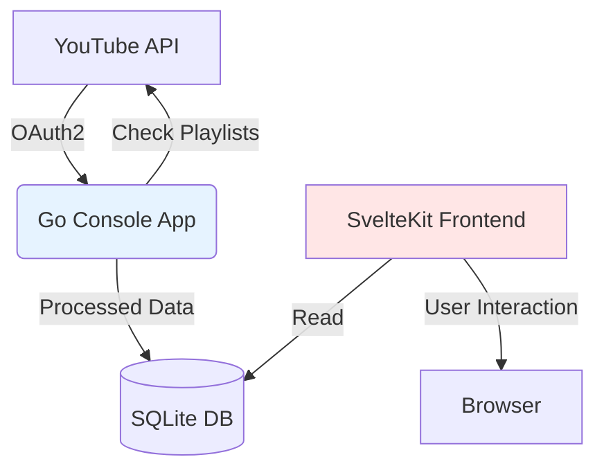
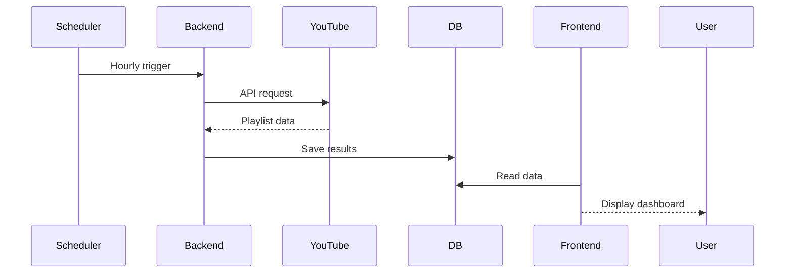

# Playlist Manager Project Documentation

## Project Overview
A dual-component system for monitoring and analyzing YouTube playlists:
1. **Go Console Application**: Periodic playlist checker that:
   - Identifies unavailable videos
   - Filters music-specific playlists
   - Stores results in SQLite database
2. **SvelteKit Frontend**: Dashboard for visualizing:
   - Music playlist contents
   - Unavailable video tracking
   - Historical data trends

## System Architecture


## File Structure

```
playlist-manager/
├── cmd/
│   └── main.go           # CLI entry point
├── internal/
│   ├── auth/             # YouTube OAuth2
│   │   └── auth.go
│   ├── db/               # Database operations
│   │   └── db.go
│   ├── models/           # Data structures
│   │   └── models.go
│   └── youtube/          # API integration
│       └── youtube.go
├── web/                  # SvelteKit frontend
│   ├── src/
│   │   ├── lib/         # Reusable components
│   │   ├── routes/      # Application pages
│   │   └── app.html
│   └── package.json
├── go.mod                # Go dependencies
├── go.sum
└── DOCUMENTATION.md      # This file
```

## Key Components

### Backend (Go)
1. **Core Functionality**
   - Periodic playlist monitoring
   - Music playlist detection (via title/description analysis)
   - Unavailable video tracking
   - SQLite data persistence

2. **Data Processing Flow**
   ```mermaid
   graph TD
   A[YouTube API] -->|OAuth2| B[Auth Service]
   B -->|Authorized Client| C[Playlist Checker]
   C -->|CheckPlaylists| D[Unavailable Videos]
   C -->|GetMusicPlaylists| E[Music Videos]
   D -->|Save| F[(Database)]
   E -->|Save| F
   ```

### Database ORM Implementation
```go
// Model definitions with GORM tags (from models.go)
type Video struct {
    ID          string `gorm:"primaryKey;column:video_id"`
    Title       string 
    Artist      string
    URL         string
    PlaylistID  string `gorm:"index"`
    Unavailable bool
}

type Playlist struct {
    ID          string `gorm:"primaryKey"`
    Name        string
    Description string
    Videos      []Video `gorm:"foreignKey:PlaylistID"`
}

// Database operations using GORM (from db.go)
func (d *DB) SaveMusicVideos(videos []Video) error {
    return d.db.Transaction(func(tx *gorm.DB) error {
        // Upsert logic using GORM's Create/Updates
        for _, video := range videos {
            result := tx.Model(&Video{}).
                Where("video_id = ?", video.ID).
                Updates(video)

            if result.RowsAffected == 0 {
                if err := tx.Create(&video).Error; err != nil {
                    return err
                }
            }
        }
        return nil
    })
}
```

Key ORM Features:
1. Automatic schema migration via `AutoMigrate()`
2. Transaction support with `db.Transaction()`
3. Model relationships with foreign key constraints
4. Upsert operations (Update or Create) pattern
5. SQLite database driver integration

### Frontend (SvelteKit)
1. Core Features:
   - Playlist management UI
   - YouTube search interface
   - Local state management

2. Tech Stack:
   - SvelteKit 2.0
   - JavaScript/TypeScript
   - CSS3 (Vanilla)

## Development Workflow

1. Run playlist checker (backend):
```bash
go run cmd/main.go --config=config.yaml
```

2. Start frontend dashboard:
```bash
cd web && npm run dev -- --open
```

3. Typical execution pattern:


## Design Decisions

1. **Security**
   - API keys stored in Go backend
   - No sensitive data in frontend
   - SQLite encryption for local DB

2. **Performance**
   - Go concurrent processing
   - SvelteKit client-side hydration
   - Local caching of API responses

## Future Roadmap
1. HTTP API layer for frontend integration
2. User notification system for unavailable videos
3. Historical trend analysis
4. Multi-platform export capabilities

## Import Fixes Documentation

### Issue
The frontend was experiencing errors with the import statement:
```typescript
import { goto } from '$app/navigation';
```
This was causing "Cannot find module '$app/navigation'" errors.

### Solution
We implemented the following fixes:

1. **Server-side Redirects**
   - Created +page.server.js for handling redirects on the server
   - Example:
     ```javascript
     export const load = async ({ url }) => {
       if (url.pathname === '/') {
         return { status: 302, redirect: '/home' };
       }
     };
     ```

2. **Client-side Navigation**
   - Moved all window.location operations to onMount
   - Example:
     ```typescript
     onMount(() => {
       window.location.href = '/home';
     });
     ```

3. **Error Handling**
   - Added graceful error handling for missing backend endpoints
   - Example:
     ```typescript
     try {
       const response = await fetch('/api/endpoint');
       if (!response.ok) {
         throw new Error('Backend unavailable');
       }
     } catch (err) {
       if (!err.message.includes('404')) {
         console.error(err);
       }
     }
     ```

### Best Practices
1. Use server-side redirects for initial page loads
2. Only access window object in onMount
3. Handle 404 errors gracefully when backend is unavailable
4. Avoid mixing client and server navigation approaches

These changes ensure proper navigation handling while maintaining compatibility with SvelteKit's architecture.
