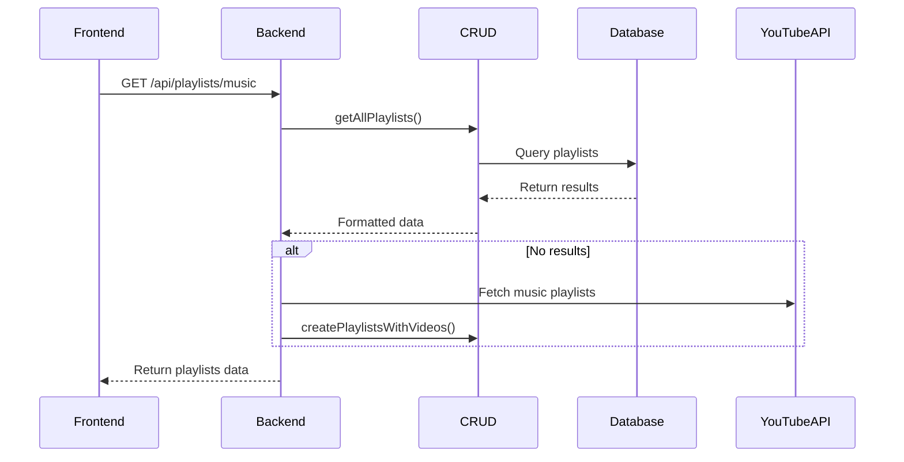
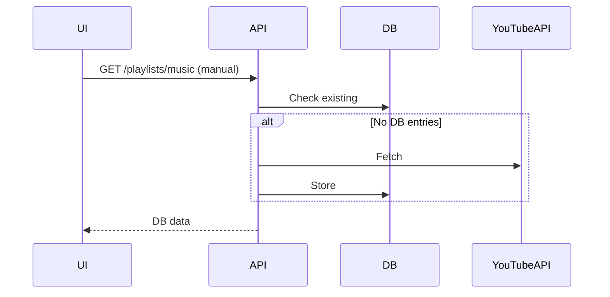

# Playlist Management System

## Database-First Architecture with CRUD Operations
Implements direct database access patterns using atomic CRUD operations



## Core Components

### Database Schema
```prisma
model Playlist {
  id           String    @id
  title        String
  description  String?
  itemCount    Int
  thumbnailUrl String?
  youtubeId    String    @unique
  videos       Video[]
  createdAt    DateTime  @default(now())
  updatedAt    DateTime  @updatedAt
}

model Video {
  id         String   @id
  title      String
  videoId    String   @unique
  url        String
  playlist   Playlist @relation(fields: [playlistId], references: [id])
  playlistId String
}
```

### CRUD Operations
```typescript
// playlists.crud.ts
export async function createPlaylist(
  tx: Prisma.TransactionClient,
  playlist: YouTubePlaylistResponse,
  userId: string
) {
  return tx.playlist.create({
    data: {
      youtubeId: playlist.id,
      name: playlist.snippet.title,
      description: playlist.snippet.description,
      isMusicPlaylist: isMusicPlaylist(playlist.snippet.title),
      itemCount: playlist.contentDetails.itemCount,
      thumbnailUrl: playlist.snippet.thumbnails.default.url,
      user: { connect: { id: userId } 
    }
  });
}

export async function createVideo(
  tx: Prisma.TransactionClient,
  item: YouTubePlaylistItemResponse,
  playlistId: string
) {
  return tx.video.create({
    data: {
      videoId: item.snippet.resourceId.videoId,
      title: item.snippet.title,
      thumbnailUrl: item.snippet.thumbnails.default.url,
      position: item.snippet.position,
      availability: isVideoAvailable(item.status.privacyStatus),
      url: `https://www.youtube.com/watch?v=${item.snippet.resourceId.videoId}`,
      playlist: { connect: { id: playlistId } }
    }
  });
}
```

### Frontend Components
```svelte
<!-- PlaylistList.svelte -->
<script lang="ts">
  import type { Playlist } from './types';
  
  export let playlists: Playlist[];
</script>

<div class="playlist-grid">
  {#each playlists as playlist}
    <div class="playlist-card">
      <h3>{playlist.name}</h3>
      <p>{playlist.itemCount} videos</p>
    </div>
  {/each}
</div>
```

#### Key Features:
- Responsive grid layout with auto-sizing cards
- Hover effects for better interactivity
- Direct display of playlist metadata from CRUD operations
- Type-safe props using Svelte's type system

## API Implementation

### `GET /api/playlists/music`
```typescript
export const GET: RequestHandler = async ({ locals }) => {
  // Authentication check
  if (!locals.user) {
    return json({ error: 'Unauthorized' }, { status: 401 });
  }

  try {
    const youtube = await getYouTubeService();
    
    // Direct YouTube API fetch
    const response = await youtube.playlists.list({
      part: ['snippet', 'contentDetails'],
      mine: true,
      maxResults: 50
    });

    // Transform response
    const playlists = response.data.items?.map(item => ({
      id: item.id,
      name: item.snippet?.title,
      description: item.snippet?.description,
      itemCount: item.contentDetails?.itemCount,
      thumbnail: item.snippet?.thumbnails?.default?.url
    })) || [];

    return json(playlists);
  } catch (error) {
    console.error('Error fetching playlists:', error);
    return json({ error: 'Failed to fetch playlists' }, { status: 500 });
  }
};
```

### `POST /api/playlists/music`
```typescript
export const POST: RequestHandler = async ({ request, locals }) => {
  // Authentication check
  if (!locals.user) {
    return json({ error: 'Unauthorized' }, { status: 401 });
  }

  try {
    const { playlistId } = await request.json();
    const youtube = await getYouTubeService();
    
    // Playlist validation
    const playlist = await getPlaylistById(playlistId);
    if (!playlist) {
      return json({ error: 'Playlist not found' }, { status: 404 });
    }

    // Video processing
    const response = await youtube.playlistItems.list({
      part: ['snippet'],
      playlistId,
      maxResults: 50
    });

    const videos = response.data.items || [];
    for (const item of videos) {
      const video = item.snippet!;
      // Video CRUD operations
      await addVideoToPlaylist(playlistId, {
        title: video.title!,
        videoId: video.resourceId!.videoId!,
        url: `https://www.youtube.com/watch?v=${video.resourceId!.videoId!}`
      });
    }

    return json({ success: true, count: videos.length });
  } catch (error) {
    console.error('Error processing playlist:', error);
    return json({ error: 'Failed to process playlist' }, { status: 500 });
  }
};
```

## Refactoring Plan

1. Manual Playlist Fetching:
- Add "Refresh Playlists" button to UI
- Convert automatic load to manual trigger
- Implement loading states/error feedback

2. Database-First Flow:


3. Pagination Strategy:

**Current Approach**
- YouTube API: Single requests with `maxResults:50` (no page handling)
- Database: Full dataset queries using `findMany()`
- UI: Display all results in one page

**Preferred Implementation**
```typescript
// YouTube API pagination
async function fetchPaginatedYouTubeData(playlistId: string) {
  let items = [];
  let pageToken = '';
  do {
    const res = await youtube.playlistItems.list({
      part: ['snippet'],
      playlistId,
      maxResults: 50,
      pageToken
    });
    items = items.concat(res.data.items);
    pageToken = res.data.nextPageToken || '';
  } while (pageToken);
  return items;
}
```

**UI Recommendations**
- Virtualized lists for performance
- Load-more button + client-side chunking
- Error boundaries per page

**Database Options**
```prisma
// Optional paginated query
const getPaginatedVideos = (playlistId: string, page: number, pageSize=50) => 
  prisma.video.findMany({
    where: { playlistId },
    skip: page * pageSize,
    take: pageSize,
    orderBy: { position: 'asc' }
  });
```

## Transaction Handling
All write operations use Prisma transactions to ensure:
- Atomic creation of playlists with their videos
- Rollback on partial failures
- Data consistency between related entities

## Error Handling
- Database connection errors
- YouTube API quota limits
- Data validation failures
- Transaction rollbacks
- Authentication token expiration
